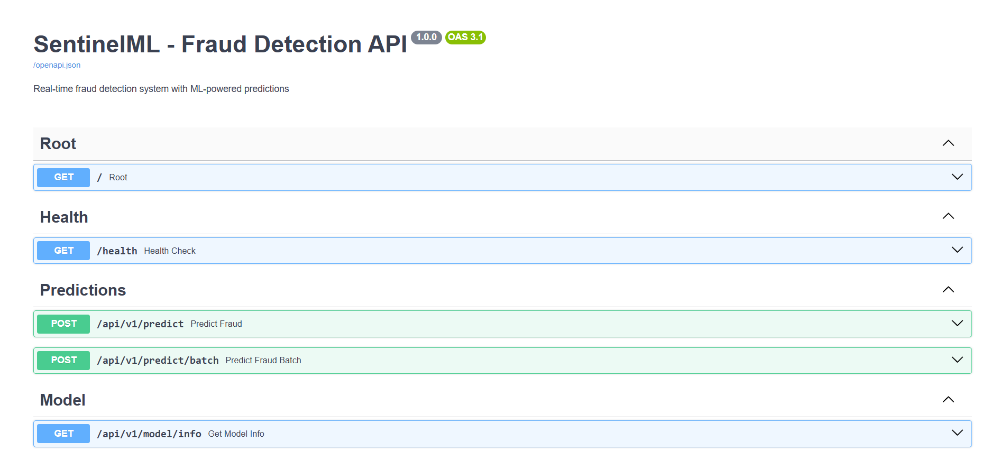
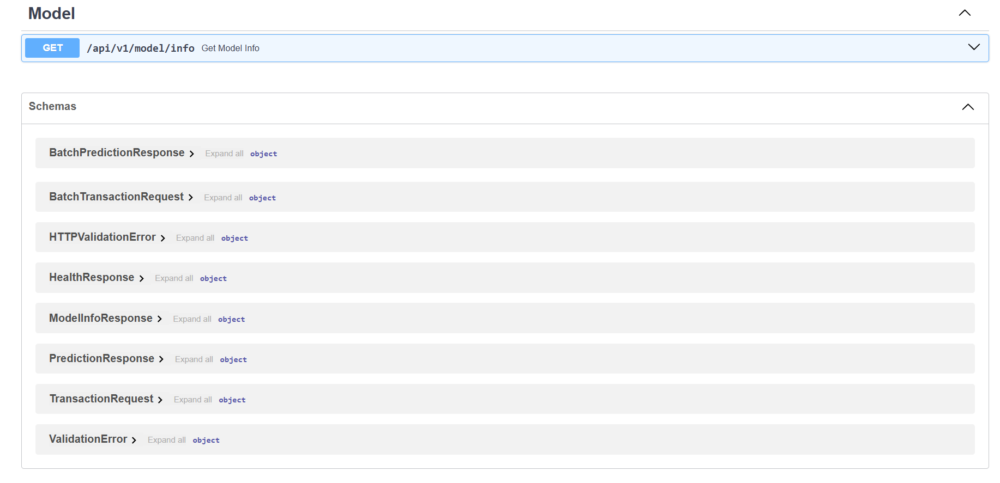

# SentinelML

SentinelML is an API-first fraud detection project built to show how a machine learning system can go from raw transaction data to a live prediction service.

It combines:
- FastAPI for the HTTP API
- scikit-learn for model training
- Redis for caching
- PostgreSQL for persistence
- MLflow for experiment tracking
- Docker Compose for local infrastructure

## What This Project Does

In simple terms, SentinelML:
- creates synthetic transaction data
- engineers fraud-related features
- trains a fraud detection model
- exposes the model through a REST API
- logs and monitors prediction activity

This repo does not include a full end-user frontend. The main interface is the API itself, plus the Swagger UI generated by FastAPI.

## Screenshots

### API Overview



### Request and Response Schemas



## How It Works

Here is the full flow in plain English:

1. Transaction data is created or received.
2. The data is cleaned and prepared.
3. Useful fraud features are built, like transaction timing, user activity, and risk scores.
4. A machine learning model learns patterns from the data.
5. The FastAPI app accepts new transactions through HTTP endpoints.
6. The model returns a fraud score and a yes or no prediction.
7. Results can be cached in Redis and logged for monitoring.

## Project Flow

`transaction -> preprocessing -> feature engineering -> model -> API prediction -> cache/logging`

## Main Parts of the Repo

| Area | Purpose |
| --- | --- |
| `sentinel_ml/api/` | FastAPI app and prediction endpoints |
| `sentinel_ml/data/` | synthetic data generation and preprocessing |
| `sentinel_ml/features/` | feature engineering logic |
| `sentinel_ml/models/` | model training, evaluation, and saving |
| `sentinel_ml/core/` | logging, cache, and database setup |
| `sentinel_ml/monitoring/` | drift detection and monitoring helpers |
| `sentinel_ml/tests/` | automated tests |
| `scripts/` | helper scripts for training and load testing |

## Quick Start

### Option 1: Run Locally

1. Create a virtual environment.

```powershell
python -m venv .venv
.\.venv\Scripts\activate
```

2. Install dependencies.

```powershell
pip install -r requirements.txt
```

3. Start the API.

```powershell
python -m uvicorn sentinel_ml.api.main:app --host 127.0.0.1 --port 8000
```

4. Open the docs.

- Swagger UI: [http://localhost:8000/docs](http://localhost:8000/docs)
- Health check: [http://localhost:8000/health](http://localhost:8000/health)

### Option 2: Run the Full Stack with Docker

This starts the API plus PostgreSQL, Redis, MLflow, Prometheus, and Grafana.

```powershell
docker compose up -d
```

Then open:

- API docs: [http://localhost:8000/docs](http://localhost:8000/docs)
- MLflow: [http://localhost:5000](http://localhost:5000)
- Grafana: [http://localhost:3000](http://localhost:3000)
- Prometheus: [http://localhost:9090](http://localhost:9090)

## Try the API in 1 Minute

### Health Check

```powershell
Invoke-RestMethod -Uri "http://localhost:8000/health" -Method Get
```

### Single Prediction

```powershell
$body = @{
  user_id = "user_12345"
  amount = 150.00
  merchant_id = "merchant_001"
  merchant_category = "online_shopping"
  transaction_type = "purchase"
  device_type = "mobile"
  location_country = "US"
} | ConvertTo-Json

Invoke-RestMethod -Uri "http://localhost:8000/api/v1/predict" `
  -Method Post `
  -ContentType "application/json" `
  -Body $body
```

Example response:

```json
{
  "transaction_id": "206603df-aee4-4108-8c72-95303681a91a",
  "fraud_score": 0.4046,
  "prediction": false,
  "confidence": "low",
  "model_version": "v20260331_012026",
  "inference_time_ms": 131.38,
  "cached": false
}
```

## Main API Endpoints

| Method | Endpoint | What it does |
| --- | --- | --- |
| `GET` | `/` | basic API info |
| `GET` | `/health` | service health |
| `POST` | `/api/v1/predict` | predict one transaction |
| `POST` | `/api/v1/predict/batch` | predict many transactions |
| `GET` | `/api/v1/model/info` | model metadata |
| `GET` | `/docs` | Swagger UI |

## Training Pipeline

The training side of the project is organized like this:

1. `SyntheticDataGenerator` builds realistic fake transaction data.
2. `DataPreprocessor` cleans missing values and normalizes fields.
3. `FeatureEngineer` creates model-ready features.
4. `FraudDetectionModel` trains a classifier.
5. `ModelTrainer` runs the end-to-end workflow.

Important files:
- `sentinel_ml/data/preprocessing.py`
- `sentinel_ml/features/engineering.py`
- `sentinel_ml/models/trainer.py`

## Monitoring and Supporting Services

SentinelML includes support for:
- Redis caching
- PostgreSQL logging
- MLflow experiment tracking
- drift detection utilities
- Prometheus and Grafana in the Docker setup

Important files:
- `sentinel_ml/core/cache.py`
- `sentinel_ml/core/database.py`
- `sentinel_ml/monitoring/drift.py`
- `docker-compose.yml`

## Testing

Run the tests with:

```powershell
python -m pytest sentinel_ml/tests/ -q
```

## Helpful Notes

- This project is best understood as a backend + ML system, not a traditional website.
- If port `8000` is busy, run the API on another port like `8010`.
- The easiest way to explore the project is through Swagger UI.
- The Docker stack is the easiest way to see the surrounding tooling together.

## Why This Repo Is Good for Learning

This project is useful if you want to learn:
- how an ML model is prepared for production use
- how to expose predictions through an API
- how to connect model serving to Redis and PostgreSQL
- how monitoring and infrastructure fit around a model

## License

Use this repository as a learning project, starter, or portfolio piece.
